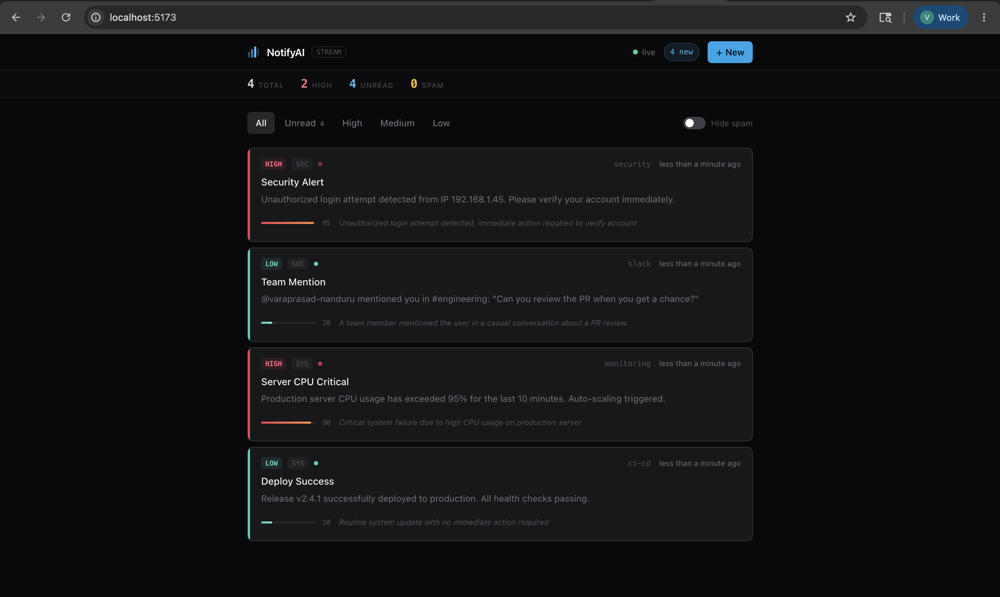
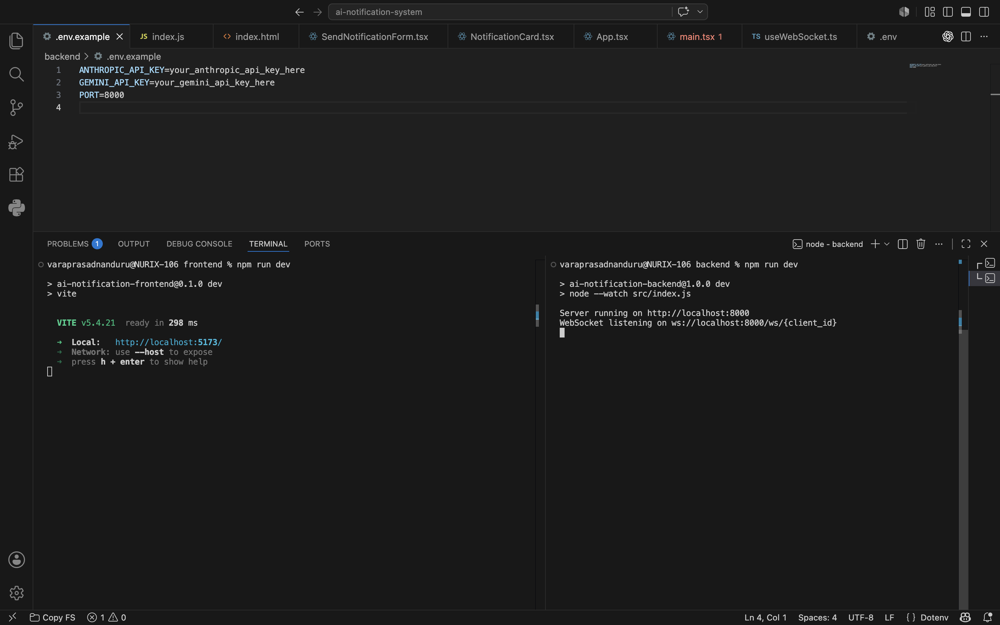

# AI-Powered Real-Time Notification System

A full-stack notification system with WebSocket delivery and AI-based intelligent classification.

---

## Screenshots

### Live Dashboard


### Project Setup in VS Code


---

## Architecture Overview

```
┌──────────────────────┐        WebSocket (ws://)       ┌──────────────────────────┐
│   React Frontend     │ ◄─────────────────────────────► │   Node.js Backend        │
│   (Vite + TypeScript)│                                  │   (Express + ws)         │
│                      │ ◄───── REST API (HTTP) ────────► │                          │
└──────────────────────┘                                  └────────────┬─────────────┘
                                                                       │
                                                                       ▼
                                                          ┌──────────────────────────┐
                                                          │  Groq AI (Llama 3.1 8B)  │
                                                          │  • Priority: High/Med/Low│
                                                          │  • Category tagging (7)  │
                                                          │  • Spam detection        │
                                                          │  • Urgency score 0–100   │
                                                          └──────────────────────────┘
```

### Flow

1. A notification is sent via the React UI (POST `/api/notifications`)
2. The backend calls **Groq's Llama 3.1 8B Instant** with the title + message
3. The model returns: priority, category, spam flag, urgency score, and a human-readable reason
4. The classified notification is stored and **broadcast via WebSocket** to all connected clients
5. The React dashboard renders it immediately with colour-coded priority, an urgency bar, and the AI reason

---

## AI Approach

**Model**: `llama-3.1-8b-instant` via [Groq API](https://console.groq.com/) — extremely low-latency inference, ideal for real-time classification.

**Classifications returned per notification**:

| Field | Values | Description |
|---|---|---|
| `priority` | high / medium / low | Urgency tier |
| `category` | security, system, social, commerce, alert, info, warning | Topic area |
| `is_spam` | true / false | Junk / phishing detection |
| `urgency_score` | 0–100 | Fine-grained urgency number |
| `ai_reason` | string | One-sentence explanation |

**Fallback**: If the API call fails (network error, quota), a keyword-based rule engine classifies the notification so the system remains functional.

---

## Tech Stack

| Layer | Technology |
|---|---|
| Frontend | React 18, TypeScript, Vite, Tailwind CSS |
| Backend | Node.js 20+, Express 4, `ws` WebSocket library |
| Real-time | Native WebSockets (`ws` + browser WebSocket API) |
| AI | Groq API — `llama-3.1-8b-instant` via `groq-sdk` |

---

## Project Structure

```
ai-notification-system/
├── backend/
│   ├── package.json
│   ├── .env.example
│   └── src/
│       ├── index.js            # Express app, WebSocket & REST endpoints
│       ├── aiClassifier.js     # Groq API integration + fallback
│       ├── notifStore.js       # In-memory notification store
│       └── wsManager.js        # WebSocket connection manager
└── frontend/
    ├── index.html
    ├── package.json
    ├── vite.config.ts
    └── src/
        ├── App.tsx                          # Root component, filter/stats logic
        ├── types.ts                         # Shared TypeScript types
        ├── hooks/
        │   └── useWebSocket.ts              # WS connection + auto-reconnect
        └── components/
            ├── NotificationCard.tsx         # Individual notification card
            └── SendNotificationForm.tsx     # Send modal with quick presets
```

---

## Setup Instructions

### Prerequisites

- Node.js 20+
- A [Groq API key](https://console.groq.com/) (free tier available)

### 1. Clone the repository

```bash
git clone <repo-url>
cd ai-notification-system
```

### 2. Backend setup

```bash
cd backend

# Install dependencies
npm install

# Configure environment
cp .env.example .env
# Edit .env and set your GROQ_API_KEY

# Start the server (with auto-reload on file changes)
npm run dev

# Or for production:
npm start
```

The backend will be available at `http://localhost:8000`.

### 3. Frontend setup

```bash
cd frontend

# Install dependencies
npm install

# Start the dev server
npm run dev
```

Open `http://localhost:5173` in your browser.

---

## Usage

1. Open the dashboard at `http://localhost:5173`
2. The green "Live" indicator confirms the WebSocket is connected
3. Click **"+ New"** to open the notification form
4. Use a **quick preset** (Security Alert, Server CPU Critical, etc.) or type your own
5. Click **"Send & Classify"** — the AI classifies it in ~300ms
6. The notification appears instantly on the dashboard with:
   - Colour-coded priority border (red = High, yellow = Medium, green = Low)
   - Category badge with icon
   - Spam warning if detected
   - Urgency bar (0–100)
   - AI reasoning text
7. Use the **filter bar** to view All / Unread / High / Medium / Low
8. Toggle **"Hide spam"** to suppress spam notifications
9. Mark notifications as read/unread or delete them

---

## API Reference

| Method | Endpoint | Description |
|---|---|---|
| `GET` | `/` | Health check, active connection count |
| `POST` | `/api/notifications` | Create & classify a notification |
| `GET` | `/api/notifications` | List all notifications |
| `PATCH` | `/api/notifications/{id}/read` | Mark as read |
| `PATCH` | `/api/notifications/{id}/unread` | Mark as unread |
| `DELETE` | `/api/notifications/{id}` | Delete a notification |
| `WS` | `/ws/{client_id}` | WebSocket connection |

### POST `/api/notifications` body

```json
{
  "title": "Security Alert",
  "message": "Unauthorized login attempt detected from 192.168.1.45",
  "source": "security"
}
```

### WebSocket message types

| Type | Direction | Payload |
|---|---|---|
| `initial` | server → client | Full notification list on connect |
| `new` | server → client | Newly classified notification |
| `update` | server → client | Read/unread state change |
| `delete` | server → client | Deleted notification ID |
| `mark_read` | client → server | `{ type, id }` |
| `mark_unread` | client → server | `{ type, id }` |

---

## Assumptions

- Notifications are stored **in memory** — they reset on server restart. For production, swap `NotificationStore` with a database (PostgreSQL / Redis).
- A single backend instance is assumed. For horizontal scaling, the WebSocket broadcast needs a pub/sub layer (Redis Channels, etc.).
- The frontend connects to `localhost:8000`. Update `WS_URL` in `useWebSocket.ts` and the fetch URLs in `App.tsx` / `SendNotificationForm.tsx` for production deployments.
- No authentication is implemented — all connected clients see all notifications.
